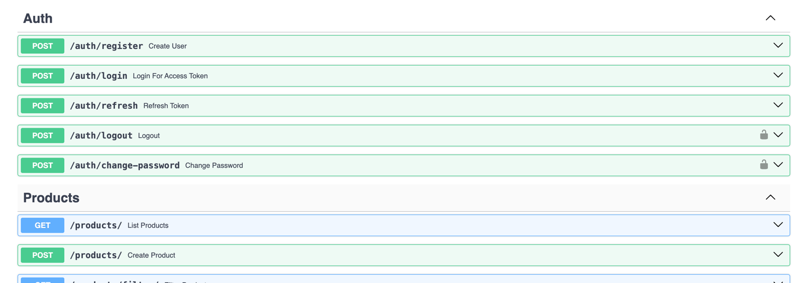

# Marketplace REST API

## Technology Stack
* Python/FastAPI
* PostgreSQL/SQLAlchemy
* Alembic
* Docker/docker-compose
* pytest
* Redis
* JWT Auth
* Swagger
* Sentry

# Installation
1. Fill .env file, by example:
```angular2html
DEBUG=
SECRET_KEY=

REDIS_HOST=

SENTRY_URL=

ALGORITHM=
ACCESS_TOKEN_EXPIRE_MINUTES=
REFRESH_TOKEN_EXPIRE_DAYS=

POSTGRES_DB=
POSTGRES_USER=
POSTGRES_PASSWORD=
DB_HOST=
DB_PORT=

POSTGRES_DB_TEST=
DB_TEST_HOST=
POSTGRES_TEST_USER=
POSTGRES_TEST_PASSWORD=
DB_TEST_PORT=
```
2. Use ```make up``` to start project
3. Run tests with ```make test``` to check if everything is correct

To down project use ```make down```

By this url you can achieve API Documentation: http://127.0.0.1:5000/api/docs


Admin Panel - http://127.0.0.1:5000/admin
* Username: admin
* Password: admin

# Main Info
* `GET /products/` and `GET /products/filter/` has pagination and caching
* `GET /metrics` can be used for Prometheus/Grafana
